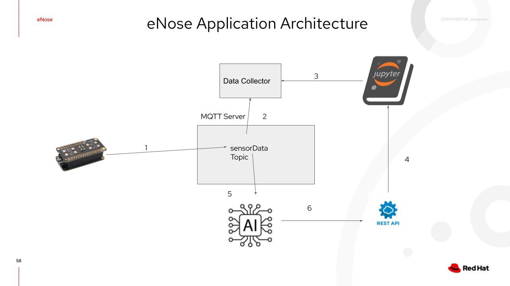

# eNose - Smell Detection Using BME688 and My Own AI Model (Built Using Jupyter notebook and scikit-learn)

## 1. Introduction
Today, I am building an Electronic Nose (eNose) that can detect and identify different smells: air, alcohol and coffee although it can also be used for detecting food spoilage, combustible/ flammable/toxic gases, air quality and many more use cases. 

**This project is different from most other similar projects based on the BME688 in that I am not using the BME AI-Studio to train my AI model. Instead, I am using Jupyter notebook and scikit-learn to train my own model.** 

The eNose hardware consists of the Bosch BME688 Evaluation Kit and the Adafruit HUZZAH32 – ESP32 Feather Board (pre-soldered).

According to Bosch:
~~~~
...The BME688 is the first gas sensor with Artificial Intelligence (AI) and integrated high-linearity and high-accuracy pressure, humidity and temperature sensors...
~~~~
[More information on the BME688](https://www.bosch-sensortec.com/products/environmental-sensors/gas-sensors/bme688/)

[More information on the Adafruit HUZZAH32](https://core-electronics.com.au/adafruit-huzzah32-esp32-feather-board-pre-soldered.html)

The image below shows the 2 components snapped together during use. There is an array of 8 BME688 sesnors on the evaluation board.

Bosch provides Arduino-based firmware examples and the **BME AI-Studio** for training AI models to identify different smells. You can collect your training data and save it on a SD card by using the sample firmware.The BME AI-Studio is propriatary software which allows you to train your AI model based on the training data and generate a configuration file and a meta information file about the AI model in a JSON-like format which you put on a SD card and insert into the BME688 Evaluation Kit to run your model. 

I am using neither the BME AI-Studio nor a SD card in this project after not getting the results I expected using the proprietary tools (likely due to my own faults). Instead, I developed my own firmware by enhancing a BSEC2 (Bosch Senortech Ennvironmental Cluster 2) library example and trained my own AI model using Jupyter notebook and scikit-learn.

[More information on the BSEC2 Library](https://github.com/BoschSensortec/Bosch-BSEC2-Library) 

## 2. The eNose Application Architecture
The following diagram explains how it works:

The steps include:
1. The BME688 Evaluation Kit sends all 8 BME688 sensor readings (in json) to the MQTT's '**sensorData**' topic every 3 seconds.

2. The Data Collector is a shell script that subscribes to the 'sensorData' topic, reformats the json and saves the data in a file for training the Jupyter notebook.

3. The Jupyter notebook uses the collected data files for air, alcohol and coffee to train an AI model (using the KNN algorithm) and assesses its accuracy. It then outputs the trained model and scaler as pickled files.

4. A Flask application uses the trained model and scaler (pickled files) to implement a REST API which accepts sensor data and returns a prediction on whether the smell is air, alcohol or coffee. The application has been containerised for deployment to either podman or MicroShift. 
 The image can be pull from quay.io: 
~~~~
podman pull quay.io/andyyuen/enose-api:1.0
~~~~

5. The AI application is also a Flask application. It subscribes to the 'sensorData' topic and receives the sensor data.

6. It then uses the data to call the REST API to see what smell it returns. It implements thresholding and a voting system such that a single change does not change the prediction immediately. When it decides that there is a change, it notifies the UI it provides to the user to switch to an appropriate animated gif image.The gif image can be one of the following:
* unknown (dog sniffing) - not sure what smell it is yet (doing thresholding)

* air - it is air that it smells

* alcohol - it is alcohol that it smells

* coffee - it is coffee that it smells

Again, the application has been containerised for deployment to either podman or MicroShift.

 The image can be pull from quay.io: 
~~~~
podman pull quay.io/andyyuen/enose-app:1.0
~~~~

## 3. Repository Directory Structure

* bsec2-mqtt - contains the Arduino firmware source code using Bosch's BSEC2 library to receive compensated sensor values from the sensor API, formats them to json and publishes the data to the 'sensorData' MQTT topic.

* deployment - contains a shell scripts: 
 '**eNosePodmanDeploy.sh**' to run the REST API and AI applications using podmand; and a yaml file for deployment to MicroShft. 
 '**mqttPodmanDeploy.sh**' starts a MQTT server which is a central piece of infrastructure to make the eNose application work.
 '**customiseEnoseDeployYaml**' creates the enoseDeploy.yaml for deployment to MicroShift. See Section 6 for details.

* enose-api - contains the REST API Flask source code and a Dockerfile for creating a container image.

* enose-app - contains the Flask-based AI application which subscribes to the 'sensorData' topic to receive the sensor data, invokes the REST API with the data to get the smell prediction. It also provides a simple UI that shows the smell detected via animated gifs, and a Dockerfile for creating a container image.

* images - contains images used in the README.md file.

* notebook - contains the Jupyter notebook for training an AI model to distinguish different smells: air, alcohol and coffee. It has a sub-folder 'enose-data' which contains the training data files: air.json, alcohol.json and coffee.json (created by the **saveMqttDataToFile.sh** shell script) and a CSV file combining data from all 3 files (created by the Jupyter notebook).

* scripts - contains the shell scripts:
 '**saveMqttDataToFile.sh**' receives data  from the 'sensorData' topic, reformats them into proper json and saves them on file. 
 '**cycleThroughSmells.sh**' lets you cycle through all the different smells in the enose-app UI by sending MQTT messages, for testing purposes only.

## 4. Building My Own BME688 Firmware
### 4.1. Setting up the Firmware Development Environment
For setup of the Arduino environment for firmware development and deployment, please follow the instruction in this [link](https://github.com/boschsensortec/Bosch-BSEC2-Library/blob/master/examples/bme68x_demo_sample/Quick_Start_Guide.md).

Please also note that the BME688 Evaluation Kit requires at least a 24 hour burn-in period before first use.

### 4.2 Compiling and Upload the Firmware
1. Plug in the BME688 Evaluation Kit to your USB port

2. Bring up the Arduino IDE, open the 'bsec2-mqtt' sketch and change "**myssid"**, "**mypassword**" and "**192.168.1.100**" in file 'bsec2-mqtt.ino'to match your environment. This assumes that you have already set up the Arduino configuration as per the instructions in Section 4.
~~~~
const char* ssid = "myssid";
const char* password = "mypassword";

// MQTT parameters
const char* mqttServer = "192.168.1.100";
~~~~

3. Click Sketch-Upload to compile/upload the firmware to your BME688 Evaluation Kit.

## 5. Training My AI Model
Please note that the trained model and scaler are already in the enose-api directory. Also, container images have already been created and available on quay.io. You may want to try them out following the instructions in Section 6 first.
 It is possible that each BME Evaluation Kit may consist of sensors with different drift and aging characteristics. If the containerised version does not work for you, then you have to train the AI model yourself using your own training data.

### 5.1 Collecting the Training Data
Please note that you will have to install the **mosquitto** Broker from your Linux repo; not that we need to run the Broker baremetal or in a VM but to get the mosquitto utilities: **mosquitto_pub** and **mosquitto_sub** for publishing and subscribing to MQTT messages.

1. Start the MQTT server (see instructions in Section 6).

2. Plug the BME688 Evaluation Kit with updated frimwarein to a USB port or a power source.

3. Run command to collect air samples which takes around 30 minutes to collection 600 samples and stops:
~~~
# Assuming you are in the eNose directory
cd scripts
./saveMqttDataToFile.sh mqttServerIP mqttServerPort air.json
~~~

4. Put the BME688 Evaluation Kit in a container with alcohol and run command:
~~~~
./saveMqttDataToFile.sh mqttServerIP mqttServerPort alcohol.json
~~~~

5. Put the BME688 Evaluation Kit in a container with coffee and run command:
~~~~
./saveMqttDataToFile.sh mqttServerIP mqttServerPort coffee.json
~~~~

6. You will see 3 files air.json, alcohol.json and coffee.json in your current directory. Upload them to a sub-folder named 'enose-data' under the directory where your Jupyter notebook is located. Create the directory if not present.

### 5.2 Running My Jupyter Notebook
1. Upload the Jupyter notebook eNoseTraining-psec2.ipynb to your Jupyter environment if not already done so.

2. Click Run->Run All Cells

You will see a couple of interesting graphs among other things, for example:

Confusion Matrix

The Confusion Matrix looks too good to be true. Usually when that happens, it points to overfitting. However when you look at the Classification Boundary graph, you will notice that the data for the 3 smells are separated cleanly without overlap. This may explain the good result.

You will find 2 pickled files in your Jupyter directory: **enoseModel.pkl*** and **enoseSc.pkl**. Copy them to the enose-api directory and build a container images by running the commands:
~~~~
# Assuming you are in the eNose directory
cd enose-api
podman build -t enose-api:1.0 .
podman images
~~~~
The will build a container image:
~~~~
localhost/enose-api
~~~~
Now you have to change the image name for enose-api in **enosePodmanDeploy.sh** to point to your image ie, localhost/enose-api.

If you need to deploy in MicroShift, your have to push your enose-api image to a publicly accessible repositoy such as quay.io (free to sign up) and modify the enoseDeployment.yaml image to point to your publicly accessible image before deployment.

## 6. Running the eNose Application
1. Start the MQTT server
~~~~
# Assuming you are going to run all containers on your laptop using podman 
# and you are in the eNose directory
cd deployment
./mqttPodmanDeploy.sh
~~~~

2. Power up the BME688 Evaluation Kit

3. start the REST API and AI application
~~~~
# Usage: ./eNosePodmanDeploy.sh mqttServerIP mqttServerPort
./eNosePodmanDeploy.sh 192.168.1.153 1883

# where 192.168.1.153 is my MQTT server IP address and 1883 is my MQTT Server port
# You need to change them to match your environment
~~~~
Note that MicroShift **mqttDeploy.yaml** uses nodeport set to 31883 hence your **enoseDeploy.yaml**'s environment variables have to be set appropriately. Remember that before you deploy the enose to MicroShift, you have to change the following values to match your environment:
~~~~
  - env:
    - name: MQTT_SERVER_IP
      value: 192.168.130.11
    - name: MQTT_SERVER_PORT
      value: "31883"
~~~~
Instead of having you start up your editor to change the file, I have created a shell script to do that for you. Just run:
~~~~
# Assuming you are at eNose directory
cd deployment
./customiseEnoseDeployYaml.sh mqttServerIP mqttServerPort
~~~~
where mqttServerIP, mqttServerPort are the server IP and port of your mQTT server respectively. This will create the enoseDeploy.yaml for you with the server IP and port you specified.

4. Point your browser (assuming running everything on your local machine using podman) to http://localhost:7005. If you are running the eNose application on MicroShift, point your beowser to http://microshiftServerIP:30705.

5. Put the BME688 Evaluation Kit in jars with different smells and see the UI switch to the animated gif for the smell. Please note that every time you switch to a different jar, it may take 10 to 20 seconds to detect the new smell. So be patient.

## 7. A MQTT Message Sample
Here is a sample message, consisting of all 8 sensor readings, sent to the 'sensorData' topic by the BME688 Evaluation Kit every 3 seconds.
~~~~
{ "datapoints" : [
[ 0, 2869500, 28.459225, 1016.180603, 34.376034, 120413.921875 ],
[ 1, 2869556, 28.517452, 1016.351135, 34.103622, 110942.578125 ],
[ 2, 2869611, 28.915897, 1016.183594, 33.742943, 89229.695312 ],
[ 3, 2869666, 29.000937, 1016.153625, 33.607368, 104553.804688 ],
[ 4, 2869721, 29.528896, 1016.609131, 33.937214, 86428.085938 ],
[ 5, 2869776, 29.515783, 1016.538391, 33.476357, 101085.882812 ],
[ 6, 2869831, 29.242722, 1016.561462, 33.770340, 53962.902344 ],
[ 7, 2869887, 29.384720, 1016.526855, 33.223034, 84044.648438 ]
] }
~~~~
The columns represent: sensor_id, time, temperature, pressure, humidity, gas_resistance, in that order.